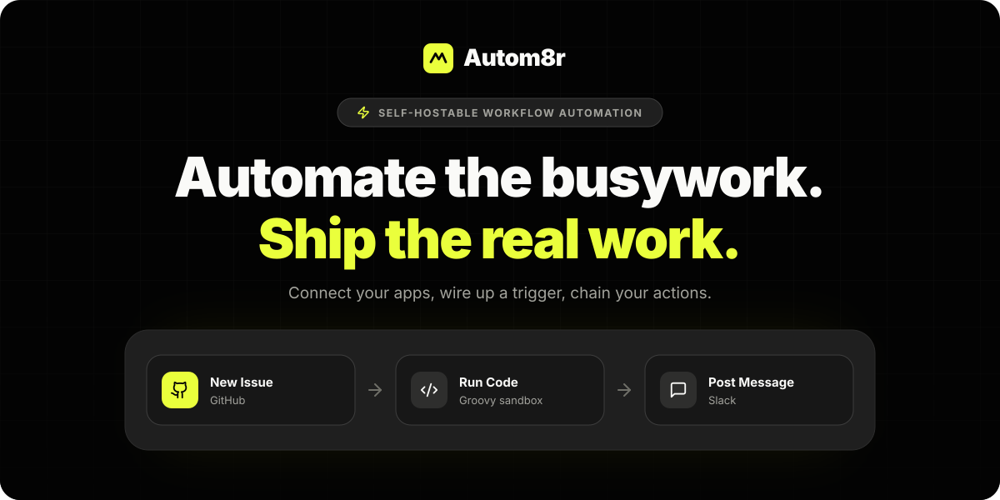
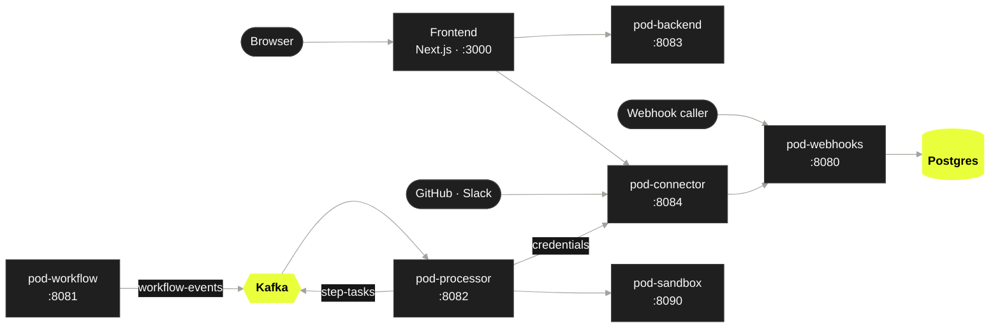

<p align="center">
  <a href="https://autom8r.pro">
    
  </a>
</p>

<p align="center">
  <a href="https://autom8r.pro"></a>
  <a href="LICENSE"></a>
  
  
  
</p>

<p align="center">
  <b>Autom8r</b> is a workflow automation platform you can run yourself.<br>
  Pick a trigger, chain your actions, and it runs every step for you, reliably.
</p>

<p align="center">
  <a href="#-quick-start-docker">Quick start</a> ·
  <a href="#-local-development">Local development</a> ·
  <a href="#-architecture">Architecture</a> ·
  <a href="CONTRIBUTING.md">Contributing</a> ·
  <a href="#-license">License</a>
</p>

---

## ⚡ What it does

| | |
|---|---|
| **Instant triggers** | Start a workflow from its own webhook URL, a GitHub event (new issue, new PR) or a Slack message. |
| **Multi-step actions** | Chain as many steps as a workflow needs, with branches, routes and filters from the Logic app. |
| **Code steps** | Run your own Groovy script in a sandbox with no network and its own user id. |
| **HTTP steps** | Call any public API. Internal and private addresses are refused. |
| **Connected apps** | Sign in with OAuth to GitHub, Slack and Notion. Tokens are encrypted at rest and refreshed for you. |
| **Reliable delivery** | Runs and steps go through an outbox, and anything stuck is picked up again, so triggered runs aren't dropped. |
| **Full run history** | Every run and step is recorded with its input, output and errors. |

**Apps today:** Webhook, HTTP, Logic, Code, GitHub, Slack and Notion.
Gmail, Google Sheets, Stripe, Discord and Trello are in the catalog as previews and are on the [roadmap](#-roadmap).

## 🧱 Architecture



| Service | Port | Job |
|---|---|---|
| `pod-frontend` | 3000 | Landing page and app: workflow builder, connections, run history (Next.js 16) |
| `pod-backend` | 8083 | Accounts and log-in (JWT), workflows, the app catalog. Runs the Flyway migrations every pod shares |
| `pod-webhooks` | 8080 | Receives trigger calls and records a new run |
| `pod-workflow` | 8081 | Publishes new runs to Kafka (`workflow-events`) through an outbox |
| `pod-processor` | 8082 | Plans each run's steps, queues them on `step-tasks` and runs them: HTTP, Logic, Code and app actions |
| `pod-connector` | 8084 | OAuth sign-in, encrypted credentials and token refresh, app triggers (GitHub and Slack webhooks) |
| `pod-sandbox` | 8090 | Runs Code-step scripts in isolation; only pod-processor can reach it |

Postgres is the source of truth. Kafka only carries work between pods, so losing a message delays a step but never loses it.

## 🚀 Quick start (Docker)

The whole platform in containers. You need **Docker** with Compose v2 and **OpenSSL**.

```bash
git clone https://github.com/PulkitBxtra/Autom8r.pro.git
cd Autom8r.pro

# 1. Settings: copy the example and fill in the secrets with random values
cp deploy/.env.example deploy/.env
sed -i.bak \
  -e "s|^DB_PASSWORD=.*|DB_PASSWORD=$(openssl rand -hex 24)|" \
  -e "s|^JWT_SECRET=.*|JWT_SECRET=$(openssl rand -hex 48)|" \
  -e "s|^INTERNAL_API_TOKEN=.*|INTERNAL_API_TOKEN=$(openssl rand -hex 32)|" \
  -e "s|^SANDBOX_TOKEN=.*|SANDBOX_TOKEN=$(openssl rand -hex 32)|" \
  -e "s|^CONNECTIONS_ENCRYPTION_KEY=.*|CONNECTIONS_ENCRYPTION_KEY=$(openssl rand -base64 32)|" \
  deploy/.env && rm deploy/.env.bak

# 2. Build and start everything, including the frontend
docker compose -f deploy/docker-compose.yml --env-file deploy/.env --profile frontend up --build -d
```

The first build takes a few minutes. Then open **http://localhost:3000**, sign up and build your first workflow.

> [!TIP]
> - Follow the logs with `docker compose -f deploy/docker-compose.yml --env-file deploy/.env logs -f`.
> - Stop everything with `... down`. Add `-v` to delete the data as well.
> - Caddy, the HTTPS proxy for servers, also starts and listens on ports 80 and 443. You don't need it locally. If those ports are taken, it fails on its own and nothing else is affected.

## 🛠 Local development

Run the pods from source so your changes show up straight away. Postgres and Kafka run in Docker.

### Prerequisites

| Tool | Version |
|---|---|
| Java (JDK) | **21**. Spring Boot 4 won't build on older versions |
| Node.js | 20.9 or newer |
| Docker | Any recent version, for Postgres and Kafka |

Each pod ships with its own Maven wrapper (`./mvnw`), so you don't need to install Maven.

### 1. Start Postgres and Kafka

```bash
# Kafka on localhost:9092 (from the root docker-compose.yml)
docker compose up -d

# Postgres on localhost:5432
docker run -d --name autom8r-postgres \
  -e POSTGRES_DB=autom8r -e POSTGRES_USER=autom8r -e POSTGRES_PASSWORD=autom8r \
  -p 5432:5432 postgres:15-alpine
```

### 2. Create your environment file

Keep it outside the repository so it can never be committed:

```bash
mkdir -p ~/.autom8r && cat > ~/.autom8r/dev.env <<EOF
export DB_URL=jdbc:postgresql://localhost:5432/autom8r
export DB_USERNAME=autom8r
export DB_PASSWORD=autom8r
export JWT_SECRET=$(openssl rand -hex 48)
export INTERNAL_API_TOKEN=$(openssl rand -hex 32)
export CONNECTIONS_ENCRYPTION_KEY=$(openssl rand -base64 32)
export KAFKA_BOOTSTRAP_SERVERS=localhost:9092
export KAFKA_SECURITY_PROTOCOL=PLAINTEXT
# Lets HTTP steps call localhost while you develop (never set this on a server)
export HTTP_ALLOW_PRIVATE=true
EOF
chmod 600 ~/.autom8r/dev.env
```

### 3. Run the pods

Run each pod in its own terminal. **Start `pod-backend` first**, because it creates the database schema that the other pods check on start-up.

```bash
source ~/.autom8r/dev.env
cd pod-backend && ./mvnw spring-boot:run
```

Then do the same for `pod-webhooks`, `pod-workflow`, `pod-processor` and `pod-connector`.

The sandbox is a plain Java program, not a Spring app:

```bash
cd pod-sandbox && ./mvnw -q -DskipTests package && java -jar target/pod-sandbox.jar
```

The sandbox isolates scripts with `sandbox-exec` on macOS. On Linux it gives each script its own user id when it runs as root. Otherwise it runs scripts without OS isolation and prints a warning, which is fine for development only.

### 4. Run the frontend

```bash
cd pod-frontend
npm install
npm run dev
```

Open **http://localhost:3000**. The frontend uses `localhost:8083`, `:8080` and `:8084` by default. To point it somewhere else, set `NEXT_PUBLIC_BACKEND_URL`, `NEXT_PUBLIC_WEBHOOKS_URL` and `NEXT_PUBLIC_CONNECTOR_URL` in `pod-frontend/.env.local`.

### 5. Connect real apps (optional)

Apps without OAuth credentials simply hide their **Connect** button. To turn an app on, create an OAuth app with the provider, set its redirect URL to `http://localhost:8084/oauth/callback`, then add its keys to `~/.autom8r/dev.env` and restart `pod-connector`:

| App | Where to create it | Settings |
|---|---|---|
| GitHub | GitHub → Settings → Developer settings → OAuth Apps | `GITHUB_OAUTH_CLIENT_ID`, `GITHUB_OAUTH_CLIENT_SECRET` |
| Notion | notion.so/profile/integrations → New connection → Public | `NOTION_OAUTH_CLIENT_ID`, `NOTION_OAUTH_CLIENT_SECRET` |
| Slack | api.slack.com/apps | `SLACK_OAUTH_CLIENT_ID`, `SLACK_OAUTH_CLIENT_SECRET`, `SLACK_SIGNING_SECRET`, `SLACK_OAUTH_CALLBACK_URL` |

Some apps need to reach you over HTTPS:
- **Slack** only accepts https redirect URLs.
- **GitHub and Slack triggers** send their events to a public URL.

For these, run a tunnel to port 8084, for example `cloudflared tunnel --url http://localhost:8084`. Then set `TRIGGERS_PUBLIC_URL` and `SLACK_OAUTH_CALLBACK_URL` (`https://<tunnel>/oauth/callback`) to the tunnel's address. The full notes are in `pod-connector/src/main/resources/application.properties`.

### Tests

```bash
source ~/.autom8r/dev.env              # the Spring tests need the database settings
cd pod-processor && ./mvnw test        # the same in any pod
cd pod-frontend && npm run lint && npm run build
```

## ☁️ Deploying

`deploy/` runs the whole stack on one Linux server, with Caddy in front providing automatic HTTPS:

1. Run `deploy/setup-vm.sh` once on a fresh Ubuntu machine. It installs Docker and opens ports 80 and 443.
2. Fill in `deploy/.env` from `.env.example`. Set `API_HOST`, `HOOKS_HOST` and `CONNECT_HOST` to your domains, and point their DNS at the server.
3. Run `deploy/deploy.sh`, and run it again after every `git pull`.

Only Caddy is open to the internet. Every other port is bound to `127.0.0.1`. The frontend can run in the same stack (`--profile frontend`) or on any Next.js host.

## 🗺 Roadmap

- [x] Webhook, HTTP, Logic and Code steps
- [x] GitHub, Slack and Notion connections, with GitHub and Slack triggers
- [x] One-server deployment with HTTPS
- [ ] Notion triggers
- [ ] Gmail and Google Sheets
- [ ] One-command self-hosting with prebuilt images

## 🤝 Contributing

Bug reports, ideas and pull requests are welcome. Read **[CONTRIBUTING.md](CONTRIBUTING.md)** before you start.

## 📄 License

Autom8r is **source-available** under the [PolyForm Noncommercial License 1.0.0](LICENSE).

- ✅ **Free** for personal use, learning, research, hobby projects and non-profits, including running it yourself and changing it.
- 💼 **Commercial use** needs a commercial license from the owner. This covers using Autom8r or any fork of it in a business, selling it, or offering it as a hosted service. [Open an issue](https://github.com/PulkitBxtra/Autom8r.pro/issues) to ask.

<p align="center">
  <br>
  <sub>Made with ⚡ by <a href="https://github.com/PulkitBxtra">Pulkit Batra</a></sub>
</p>
